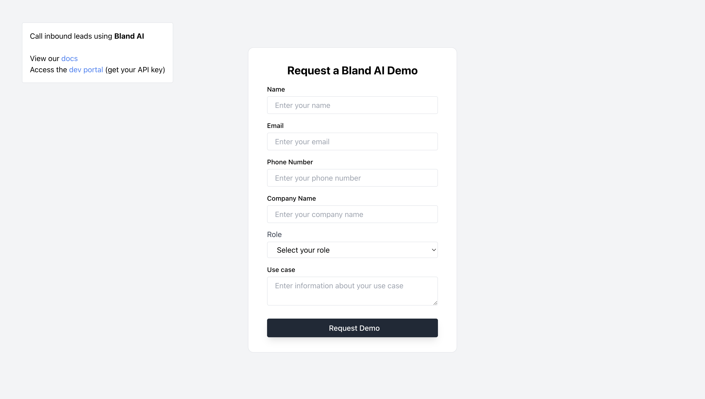

## Last bits of context

The most important file is `server.js`. Go there to see the prompt for the AI phone agent. Everything else enables the visual interface (the form) so that you can interact with our API.

# Frontend setup

Open your terminal and type `npm install` to install all your dependencies.

Then run `npm start`. The react application will load up and display in your browser.

# Backend setup

Open your terminal and navigate to your backend by typing `cd backend`.

Once again run 'npm install` to install your dependencies.

Next, to run your server, type `node server.js` into your terminal. Your server should start running on port 4000.

## Getting Your API key

At this point you've hooked everything up! But you've still go some work left.

Within your backend folder, create a `.env` file. Within that file, insert the following:

```
BLAND_API_KEY=sk-xxxxxxxxxxxxxxxxxx
```

To get your own API key, go to the [developer portal](https://app.bland.ai) and sign up. Once you have your API key, update the value in your `.env` file.

## Updating the `transfer phone number`

Open your `server.js` file and update the `TRANSFER_PHONE_NUMBER`. If you don't have a second phone on hand, try using your own number.

That way, when the AI phone agent triggers the call transfer, it'll be obvious.

# Final steps

Restart your node server.

Open the web application, fill out the form, and hit submit.

You should receive a phone call.
